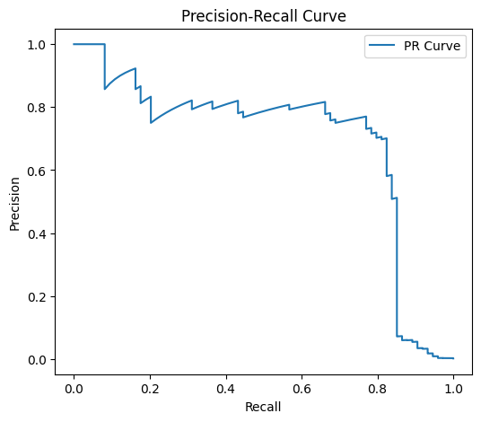
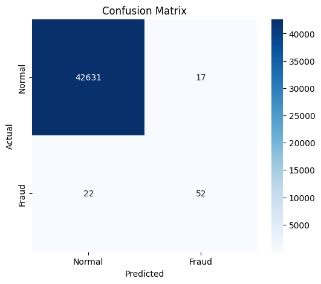

# Credit Card Fraud Detection using Gaussian Mixture Models (GMM)

## Overview

This project focuses on detecting fraudulent credit card transactions using **unsupervised anomaly detection techniques**, specifically **Gaussian Mixture Models (GMMs)**.

Fraud detection is challenging due to **extreme class imbalance**, where fraudulent transactions represent a very small fraction of the dataset. Instead of treating this as a standard classification problem, this project models fraud as **anomalies in the data distribution**.

The goal was to build a **structured, reproducible pipeline** that:
* I wanted to understand how anomaly detection behaves in real-world imbalanced datasets instead of relying only on standard classifiers.
* models normal and fraudulent behavior
* identifies anomalies using probabilistic methods
* optimizes decision thresholds
* evaluates performance using appropriate metrics (F1, PR-AUC)

---

## Problem Statement

* Fraudulent transactions are extremely rare (~0.17%)
* Accuracy is not a meaningful metric
* Missing fraud cases can have serious consequences

This project treats fraud detection as an **anomaly detection problem**, where fraudulent transactions are identified as deviations from normal patterns.

---

## Dataset

* Source: Credit Card Fraud Detection Dataset (Kaggle)
* Transactions: ~284,000
* Fraud ratio: ~0.17%

Features:

* `V1–V28`: PCA-transformed numerical features
* `Class`: Target (1 = Fraud, 0 = Normal)

For modeling, a subset of features (`V11–V20`) was used.

---

## Project Structure

```text
Probabilistic-Fraud-Detection-with-Gaussian-Mixtures/
│
├── data/
│   ├── README.md
│   └── creditcard.csv
│
├── notebooks/
│   ├── eda.ipynb
│   └── outputs/
├── src/
│   ├── data/
│   │   └── load_data.py
│   ├── features/
│   │   └── preprocess.py
│   ├── models/
│   │   ├── gmm_model.py
│   │   ├── experiments.py
│   │   └── final_evaluation.py
│   ├── evaluation/
│   │   ├── metrics.py
│   │   ├── thresholding.py
│   │   └── plots.py
│   └── utils/
│       └── seed.py
│
├── outputs/
│   ├── figures/
│   └── tables/
│
├── requirements.txt
├── .gitignore
└── README.md
```

---

## Approach

### 1. Exploratory Data Analysis

* Analyzed class imbalance
* Studied feature distributions
* Identified features with strong fraud separation (e.g., V12, V14, V17)

---

### 2. Single-Feature Modeling

Each feature was modeled independently using a Gaussian distribution.

**Top features:**

| Feature | F1 Score |
| ------- | -------- |
| V12     | 0.624    |
| V14     | 0.559    |
| V17     | 0.531    |

Insight: Individual features provide moderate signal but are insufficient alone.

---

### 3. Multivariate GMM

Combined features into a joint model.

**Configuration:**

* Features: `V14, V17`
* Components: 1

**Results:**

* ROC-AUC: 0.961
* PR-AUC: 0.593
* F1 Score: 0.652

Insight: Combining features improves detection performance.

---

### 4. Two-Model GMM (Final Approach)

Trained separate GMMs for:

* normal transactions
* fraudulent transactions

Used **log-likelihood difference** as anomaly score.
+ I chose this approach because it directly compares how likely a transaction is under fraud vs normal distributions.

---

### 5. Threshold Optimization

* Efficient threshold search (O(n log n))
* Threshold selected using **F1-score on validation set**

---

### 6. Final Evaluation

* Model trained on training set
* Threshold tuned on validation set
* Final performance evaluated on test set

---

## Results

### Best Model Configuration

* Features: `V11, V12, V14, V16, V17`
* Normal model: 2 Gaussian components
* Fraud model: 3 Gaussian components

---

### Final Performance (Test Set)

| Metric    | Value |
| --------- | ----- |
| ROC-AUC   | 0.969 |
| PR-AUC    | 0.697 |
| Precision | 0.754 |
| Recall    | 0.703 |
| F1 Score  | 0.727 |

Validation F1: **0.738**

---

### Example Outputs




## Key Insights

* **PR-AUC is more informative than ROC-AUC** in highly imbalanced datasets
* Fraud transactions lie in **low-density regions of feature space**
* Modeling fraud and normal distributions separately improves performance
* Fraud class shows higher variability → requires more mixture components
* Threshold selection significantly impacts precision-recall trade-off

---

## Outputs

### Saved Figures (`outputs/figures/`)

* ROC Curve
* Precision-Recall Curve
* Confusion Matrix
* Threshold vs F1 Curve
* Feature distributions

### Saved Tables (`outputs/tables/`)

* Single-feature experiment results
* Multifeature experiment results
* Two-model experiment results
* Final evaluation results

---

## How to Run

### 1. Install dependencies

```bash
pip install -r requirements.txt
```

---

### 2. Download dataset

Download from:
https://raw.githubusercontent.com/chyr98/Dataset/main/creditcard.csv

Place in:

```text
data/creditcard.csv
```

---

### 3. Run experiments

```bash
python -m src.models.experiments
```

---

### 4. Run final evaluation

```bash
python -m src.models.final_evaluation
```

---

## Limitations

* PCA-transformed features limit interpretability
* Extreme class imbalance makes evaluation sensitive
* Unsupervised methods may underperform supervised models when labels are available

---

## Future Improvements

* Compare with Isolation Forest and One-Class SVM
* Use full feature set (`V1–V28`)
* Explore deep learning-based anomaly detection
* Incorporate cost-sensitive evaluation

---

## Key Takeaways

This project showcases:

* anomaly detection using probabilistic models
* handling extreme class imbalance
* threshold optimization
* model comparison and evaluation
* building a structured ML pipeline

---

## Author

Sohen Patel